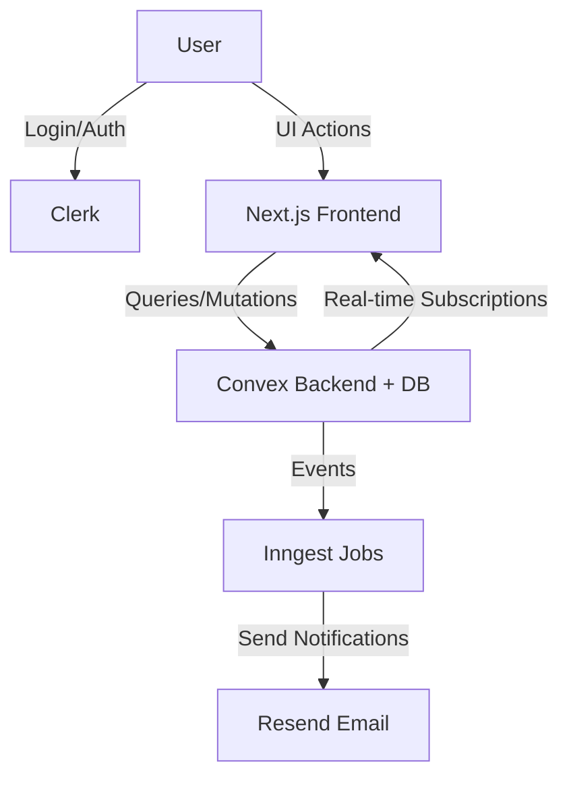

---

# BillBuddy

> **BillBuddy** is a modern expense-sharing application that makes splitting bills effortless while providing real-time balances, reminders, and insights. Inspired by Splitwise, it’s built with a lean, managed-services architecture to ensure scalability, security, and delightful UX.

---

## 🚀 Features

* 📊 **Smart Expense Splitting** — Equal, percentage, or exact amounts
* 👥 **Groups & Contacts** — Manage roommates, trips, or friend groups
* 🔔 **Reminders & Notifications** — Stay on top of pending balances
* 📩 **Email Reports** — Automated monthly spending reports via email
* ⚡ **Real-time Updates** — No manual refresh, data syncs instantly
* 💾 **Receipts** — Attach and store bills securely
* 🔐 **Authentication & Security** — Powered by Clerk (OAuth + sessions)

---

## 🛠️ Tech Stack

* **Frontend**: Next.js (App Router), Tailwind CSS, Radix UI, Recharts
* **Auth**: Clerk (Social login + JWT sessions)
* **Backend & Database**: Convex (queries, mutations, real-time subscriptions)
* **Background Jobs**: Inngest (scheduled + event-driven workflows)
* **Email**: Resend (transactional + reminder emails)
* **Hosting**: Vercel (frontend), Convex managed infra

---

## 📐 System Design (High-Level)




**Flow:** User → Clerk (session) → Convex (queries/mutations) → updates via subscriptions. Jobs & reminders handled by Inngest + Resend.

---

## 📂 Project Structure

```
billbuddy/
 ├── app/               # Next.js app routes (dashboard, groups, auth)
 ├── components/        # Reusable UI components
 ├── convex/            # Convex backend functions (queries/mutations/actions)
 ├── inngest/           # Background jobs & workflows
 ├── utils/             # Helpers (validators, formatters, etc.)
 ├── public/            # Static assets
 └── README.md          # Project documentation
```

---

## 🔑 Environment Variables

| Variable                            | Description                  |
| ----------------------------------- | ---------------------------- |
| `NEXT_PUBLIC_CONVEX_URL`            | Convex backend endpoint      |
| `NEXT_PUBLIC_CLERK_PUBLISHABLE_KEY` | Clerk frontend key           |
| `CLERK_SECRET_KEY`                  | Clerk server key             |
| `RESEND_API_KEY`                    | Resend email API key         |
| `INNGEST_EVENT_KEY`                 | Inngest signing key          |
| `ASSET_BUCKET_URL`                  | Object storage bucket URL    |
| `ASSET_BUCKET_SIGNING_KEY`          | Key for signing file uploads |

---

## 📦 Installation & Setup

1. **Clone the repo**

   ```bash
   git clone https://github.com/your-username/billbuddy.git
   cd billbuddy
   ```

2. **Install dependencies**

   ```bash
   npm install
   ```

3. **Set up environment variables**
   Create a `.env.local` file and add the required vars (see above).

4. **Run locally**

   ```bash
   npm run dev
   ```

5. Visit → [http://localhost:3000](http://localhost:3000)

---

## 🧪 Testing

* **Unit & Integration**: Vitest / Jest
* **E2E**: Playwright / Cypress
* **Load Testing**: Simulated group activity (10k expenses)

Run tests:

```bash
npm run test
```

---

## 📅 Roadmap

* [x] Core flows (expenses, groups, settlements)
* [x] Email reminders & reports
* [ ] Weekly/monthly insights & CSV export
* [ ] Multi-currency support
* [ ] React Native mobile app

---

## 🔒 Security

* Clerk-powered authentication & authorization


---

## 👥 Contributors

* **Abhishek Singh Negi** – Developer & System Designer

---

## 📜 License

This project is licensed under the MIT License.

---


